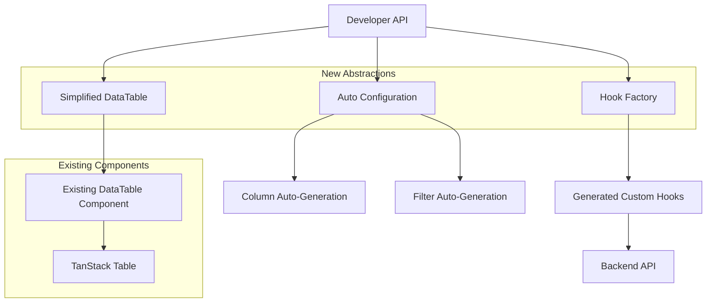
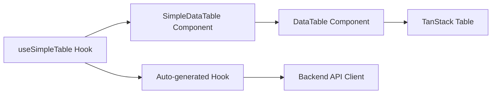

# Design Document

## Overview

This design creates a simplified, backend-driven DataTable system that reduces configuration complexity while maintaining full functionality. The solution provides three main abstractions: a Hook Factory for generating data-specific hooks, a Simplified DataTable wrapper, and Auto Configuration utilities that work together to create a declarative API for table management.

## Architecture

### High-Level Architecture



### Component Hierarchy



## Components and Interfaces

### 1. Hook Factory (`createTableHook`)

Creates type-safe, entity-specific hooks with minimal configuration:

```typescript
// Factory function
function createTableHook<T>(config: TableHookConfig<T>) {
  return () => {
    // Generated hook implementation
    const [params, setParams] = useState(defaultParams);
    const queryResponse = useQuery(config.endpoint, params);
    
    return {
      data: queryResponse.data?.data || [],
      pagination: queryResponse.data?.pagination,
      isLoading: queryResponse.isLoading,
      error: queryResponse.error,
      updateFilters: (newParams) => setParams(newParams),
      refetch: queryResponse.refetch
    };
  };
}

// Usage
const useCustomersTable = createTableHook({
  endpoint: '/api/customers',
  defaultPageSize: 10,
  defaultSort: { field: 'createdAt', direction: 'desc' }
});
```

### 2. Simplified DataTable Component

A wrapper that provides a declarative API:

```typescript
interface SimpleDataTableProps<T> {
  // Minimal required props
  hook: () => TableHookResult<T>;
  columns?: ColumnConfig<T>[];
  
  // Optional enhancements
  filters?: FilterConfig<T>[];
  actions?: ActionConfig<T>[];
  
  // Auto-configuration
  autoColumns?: boolean;
  autoFilters?: boolean;
}

function SimpleDataTable<T>({
  hook,
  columns,
  filters,
  actions,
  autoColumns = true,
  autoFilters = true
}: SimpleDataTableProps<T>) {
  const tableData = hook();
  
  // Auto-generate columns if not provided
  const finalColumns = columns || (autoColumns ? generateColumns(tableData.data) : []);
  
  // Auto-generate filters if not provided
  const finalFilters = filters || (autoFilters ? generateFilters(tableData.data) : []);
  
  return (
    <DataTable
      data={tableData.data}
      columns={finalColumns}
      serverPagination={{
        pageIndex: tableData.pagination.page - 1,
        pageSize: tableData.pagination.pageSize,
        pageCount: tableData.pagination.totalPages,
        total: tableData.pagination.total,
        onPaginationChange: tableData.updateFilters
      }}
      facetedFilters={finalFilters}
      isLoading={tableData.isLoading}
    />
  );
}
```

### 3. Auto Configuration System

#### Column Auto-Generation

```typescript
function generateColumns<T>(data: T[]): ColumnDef<T>[] {
  if (!data.length) return [];
  
  const sample = data[0];
  return Object.keys(sample).map(key => ({
    accessorKey: key,
    header: formatHeader(key),
    cell: ({ getValue }) => formatCell(getValue(), typeof sample[key])
  }));
}

function formatCell(value: any, type: string) {
  switch (type) {
    case 'string':
      return isDate(value) ? formatDate(value) : value;
    case 'number':
      return formatNumber(value);
    case 'boolean':
      return <Badge variant={value ? 'success' : 'secondary'}>{value ? 'Sí' : 'No'}</Badge>;
    default:
      return String(value);
  }
}
```

#### Filter Auto-Generation

```typescript
function generateFilters<T>(data: T[]): FacetedFilter[] {
  if (!data.length) return [];
  
  const sample = data[0];
  const filters: FacetedFilter[] = [];
  
  Object.entries(sample).forEach(([key, value]) => {
    if (typeof value === 'boolean') {
      filters.push({
        column: key,
        title: formatHeader(key),
        options: [
          { label: 'Sí', value: true },
          { label: 'No', value: false }
        ]
      });
    } else if (isEnum(key, data)) {
      const uniqueValues = [...new Set(data.map(item => item[key]))];
      filters.push({
        column: key,
        title: formatHeader(key),
        options: uniqueValues.map(val => ({ label: String(val), value: val }))
      });
    }
  });
  
  return filters;
}
```

## Data Models

### Configuration Types

```typescript
interface TableHookConfig<T> {
  endpoint: string;
  defaultPageSize?: number;
  defaultSort?: SortConfig;
  defaultFilters?: FilterParams;
  transform?: (data: any) => T[];
}

interface ColumnConfig<T> {
  key: keyof T;
  header?: string;
  formatter?: (value: any) => React.ReactNode;
  sortable?: boolean;
  filterable?: boolean;
}

interface FilterConfig<T> {
  key: keyof T;
  type: 'select' | 'text' | 'date' | 'boolean';
  options?: { label: string; value: any }[];
  placeholder?: string;
}

interface ActionConfig<T> {
  label: string;
  icon?: React.ComponentType;
  onClick: (row: T) => void;
  variant?: 'default' | 'destructive' | 'outline';
}
```

### Backend Integration Types

```typescript
interface PaginatedResponse<T> {
  data: T[];
  pagination: {
    page: number;
    pageSize: number;
    total: number;
    totalPages: number;
  };
}

interface TableParams {
  page: number;
  pageSize: number;
  sort?: {
    field: string;
    direction: 'asc' | 'desc';
  };
  filters?: Record<string, any>;
  search?: string;
}
```

## Error Handling

### Centralized Error Management

```typescript
function useTableError() {
  const handleError = (error: any) => {
    if (error.status === 404) {
      return { message: 'No se encontraron datos', retry: true };
    }
    if (error.status >= 500) {
      return { message: 'Error del servidor', retry: true };
    }
    return { message: 'Error desconocido', retry: false };
  };
  
  return { handleError };
}
```

### Error UI Components

```typescript
function TableErrorState({ error, onRetry }: { error: any; onRetry: () => void }) {
  const { handleError } = useTableError();
  const errorInfo = handleError(error);
  
  return (
    <div className="text-center py-8">
      <p className="text-muted-foreground">{errorInfo.message}</p>
      {errorInfo.retry && (
        <Button onClick={onRetry} className="mt-4">
          Reintentar
        </Button>
      )}
    </div>
  );
}
```

## Testing Strategy

### Unit Tests
- Test hook factory with different configurations
- Test auto-generation functions with various data types
- Test error handling scenarios

### Integration Tests
- Test complete table workflow with mock backend
- Test pagination, filtering, and sorting integration
- Test error states and recovery

### Component Tests
- Test SimpleDataTable with different prop combinations
- Test auto-configuration behavior
- Test backward compatibility with existing DataTable

## Usage Examples

### Basic Usage (3 lines of code)

```typescript
const useCustomers = createTableHook({ endpoint: '/api/customers' });

function CustomersPage() {
  return <SimpleDataTable hook={useCustomers} />;
}
```

### Advanced Usage with Custom Configuration

```typescript
const useCustomers = createTableHook({
  endpoint: '/api/customers',
  defaultPageSize: 25,
  defaultSort: { field: 'name', direction: 'asc' }
});

function CustomersPage() {
  return (
    <SimpleDataTable
      hook={useCustomers}
      columns={[
        { key: 'name', header: 'Nombre del Cliente' },
        { key: 'email', header: 'Correo Electrónico' },
        { key: 'status', formatter: (value) => <StatusBadge status={value} /> }
      ]}
      filters={[
        { key: 'status', type: 'select', options: statusOptions },
        { key: 'createdAt', type: 'date' }
      ]}
      actions={[
        { label: 'Editar', onClick: (row) => editCustomer(row.id) },
        { label: 'Eliminar', onClick: (row) => deleteCustomer(row.id), variant: 'destructive' }
      ]}
    />
  );
}
```

## Migration Strategy

1. **Phase 1**: Create new abstractions alongside existing components
2. **Phase 2**: Migrate one table at a time to new API
3. **Phase 3**: Deprecate old patterns while maintaining backward compatibility
4. **Phase 4**: Remove deprecated code after full migration

## Project Structure Reorganization

### Current Structure Analysis
Tu proyecto actualmente tiene una estructura mixta que es común pero no óptima:

```
/app (Next.js App Router)
/src/lib (Solo algunas utilidades)
/components (Componentes fuera de src)
/lib (Más utilidades fuera de src)
/hooks (Hooks fuera de src)
```

### Recommended Unified Structure

Sí, definitivamente puedes y debes mover todo dentro de `src`. Esta es la estructura recomendada:

```
/src
  /app (Next.js App Router pages y layouts)
    /dashboard
      /customers
        page.tsx
      /liquidations
        page.tsx
      layout.tsx
      page.tsx
    globals.css
    layout.tsx
    page.tsx
  /components (Todos los componentes)
    /ui
    /forms
    /datatable
    dashboard-layout.tsx
    login-form.tsx
  /lib (Todas las utilidades)
    api-client.ts
    utils.ts
    backend.ts
  /hooks (Todos los hooks personalizados)
    use-mobile.ts
    use-pagination.ts
  /types (Tipos TypeScript centralizados)
    api.ts
    common.ts
  /styles (Si quieres mover los estilos también)
    globals.css
```

### Required Configuration Changes

#### 1. Update `tsconfig.json`
```json
{
  "compilerOptions": {
    "target": "es5",
    "lib": ["dom", "dom.iterable", "es6"],
    "allowJs": true,
    "skipLibCheck": true,
    "strict": true,
    "noEmit": true,
    "esModuleInterop": true,
    "module": "esnext",
    "moduleResolution": "bundler",
    "resolveJsonModule": true,
    "isolatedModules": true,
    "jsx": "preserve",
    "incremental": true,
    "plugins": [
      {
        "name": "next"
      }
    ],
    "baseUrl": ".",
    "paths": {
      "@/*": ["./src/*"]
    }
  },
  "include": ["next-env.d.ts", "**/*.ts", "**/*.tsx", ".next/types/**/*.ts", "src/**/*"],
  "exclude": ["node_modules"]
}
```

#### 2. Update `next.config.mjs`
Next.js automáticamente detecta la carpeta `src/app`, no necesitas configuración especial:

```javascript
/** @type {import('next').NextConfig} */
const nextConfig = {
  // Tu configuración actual
};

export default nextConfig;
```

#### 3. Update `components.json` (para shadcn/ui)
```json
{
  "$schema": "https://ui.shadcn.com/schema.json",
  "style": "default",
  "rsc": true,
  "tsx": true,
  "tailwind": {
    "config": "tailwind.config.js",
    "css": "src/app/globals.css",
    "baseColor": "slate",
    "cssVariables": true,
    "prefix": ""
  },
  "aliases": {
    "components": "@/components",
    "utils": "@/lib/utils"
  }
}
```

#### 4. Update Import Paths
Todos los imports cambiarían de:
```typescript
// Antes
import { Button } from '@/components/ui/button'
import { cn } from '@/lib/utils'

// Después (si mantienes el path mapping @/*)
import { Button } from '@/components/ui/button'  // Sin cambios
import { cn } from '@/lib/utils'  // Sin cambios
```

### Migration Steps

1. **Create new src structure**:
   ```bash
   mkdir -p src/components src/lib src/hooks src/types
   ```

2. **Move app directory**:
   ```bash
   mv app src/
   ```

3. **Move components**:
   ```bash
   mv components/* src/components/
   ```

4. **Move lib files**:
   ```bash
   mv lib/* src/lib/
   ```

5. **Move hooks**:
   ```bash
   mv hooks/* src/hooks/
   ```

6. **Update configurations** as shown above

7. **Test the application** to ensure all imports work correctly

### Benefits of This Structure

1. **Cleaner root directory** - Solo archivos de configuración en la raíz
2. **Better organization** - Todo el código fuente en un lugar
3. **Easier imports** - Paths más consistentes
4. **Industry standard** - Sigue las mejores prácticas de Next.js
5. **Better tooling support** - IDEs y herramientas funcionan mejor

### Potential Issues and Solutions

1. **Import errors after migration**:
   - Solución: Usar find/replace en todo el proyecto para actualizar imports relativos

2. **CSS imports**:
   - Actualizar imports de CSS en `layout.tsx` si es necesario

3. **Public assets**:
   - Los assets en `/public` no necesitan moverse, Next.js los maneja automáticamente

4. **Environment variables**:
   - No necesitan cambios, siguen funcionando igual

Esta reorganización te dará una base más sólida para implementar el sistema de DataTable simplificado y para el crecimiento futuro de tu aplicación.